# BaseFund – Smart Contract Evolution Series


---

## Overview
**BaseFund** is an experimental series of smart contracts deployed on [Base Network](https://base.org).
The project evolves step-by-step from a **basic escrow crowdfunding contract** into more complex and feature-rich versions.
Each version highlights improvements in **security, gas efficiency, developer UX, and best practices**.

---

## Evolution Tree

```mermaid
graph TD
  v0["v0 · Basic Escrow"] --> v1["v1 · Events & Custom Errors"]
  v1 --> v2["v2 · Roles & Access Control"]
  v2 --> v3["v3 · Pausable + ReentrancyGuard"]
  v3 --> v4["v4 · Gas Optimizations"]
  v4 --> v5["v5 · ERC-20 Contributions"]
  v5 --> v6["v6 · Fees & Treasury"]
  v6 --> v7["v7 · Factory/Proxy"]
  v7 --> v8["v8 · Meta-transactions (ERC-2771)"]
  v8 --> v9["v9 · Security Hardening"]
  v9 --> v10["v10 · UX & Security: Permit/Allowlist/Cooldowns"]
```



---

| Version | Key Change                                | Sepolia Deploy                                           | Mainnet Deploy                                           | Build Config                                                                                                                                                                        |
| ------- | ----------------------------------------- | -------------------------------------------------------- | -------------------------------------------------------- | ----------------------------------------------------------------------------------------------------------------------------------------------------------------------------------- |
| v0      | Basic escrow crowdfunding                 | [base-sepolia.json](./deployments/v0/base-sepolia.json)  | [base-mainnet.json](./deployments/v0/base-mainnet.json)  | mainnet: [v0.standard-json.mainnet.json](./build-config/v0.standard-json.mainnet.json) · sepolia: [v0.standard-json.sepolia](./build-config/v0.standard-json.sepolia)               |
| v1      | Events & custom errors                    | [base-sepolia.json](./deployments/v1/base-sepolia.json)  | [base-mainnet.json](./deployments/v1/base-mainnet.json)  | mainnet: [v1.standard-json.mainnet.json](./build-config/v1.standard-json.mainnet.json) · sepolia: [v1.standard-json.sepolia.json](./build-config/v1.standard-json.sepolia.json)     |
| v2      | Roles & AccessControl                     | [base-sepolia.json](./deployments/v2/base-sepolia.json)  | [base-mainnet.json](./deployments/v2/base-mainnet.json)  | mainnet: [v2.standard-json.mainnet.json](./build-config/v2.standard-json.mainnet.json) · sepolia: [v2.standard-json.sepolia.json](./build-config/v2.standard-json.sepolia.json)     |
| v3      | Pausable + ReentrancyGuard                | [base-sepolia.json](./deployments/v3/base-sepolia.json)  | [base-mainnet.json](./deployments/v3/base-mainnet.json)  | mainnet: [v3.standard-json.mainnet.json](./build-config/v3.standard-json.mainnet.json) · sepolia: [v3.standard-json.sepolia.json](./build-config/v3.standard-json.sepolia.json)     |
| v4      | Gas optimizations                         | [base-sepolia.json](./deployments/v4/base-sepolia.json)  | [base-mainnet.json](./deployments/v4/base-mainnet.json)  | mainnet: [v4.standard-json.mainnet.json](./build-config/v4.standard-json.mainnet.json) · sepolia: [v4.standard-json.sepolia.json](./build-config/v4.standard-json.sepolia.json)     |
| v5      | ERC-20 contributions                      | [base-sepolia.json](./deployments/v5/base-sepolia.json)  | [base-mainnet.json](./deployments/v5/base-mainnet.json)  | mainnet: [v5.standard-json.mainnet.json](./build-config/v5.standard-json.mainnet.json) · sepolia: [v5.standard-json.sepolia.json](./build-config/v5.standard-json.sepolia.json)     |
| v6      | Fees & treasury flows                     | [base-sepolia.json](./deployments/v6/base-sepolia.json)  | [base-mainnet.json](./deployments/v6/base-mainnet.json)  | mainnet: [v6.standard-json.mainnet.json](./build-config/v6.standard-json.mainnet.json) · sepolia: [v6.standard-json.sepolia.json](./build-config/v6.standard-json.sepolia.json)     |
| v7      | Factory/Proxy ready                       | [base-sepolia.json](./deployments/v7/base-sepolia.json)  | [base-mainnet.json](./deployments/v7/base-mainnet.json)  | mainnet: [v7.standard-json.mainnet.json](./build-config/v7.standard-json.mainnet.json) · sepolia: [v7.standard-json.sepolia.json](./build-config/v7.standard-json.sepolia.json)     |
| v8      | Meta-tx (ERC-2771 relayer)                | [base-sepolia.json](./deployments/v8/base-sepolia.json)  | [base-mainnet.json](./deployments/v8/base-mainnet.json)  | mainnet: [v8.standard-json.mainnet.json](./build-config/v8.standard-json.mainnet.json) · sepolia: [v8.standard-json.sepolia.json](./build-config/v8.standard-json.sepolia.json)     |
| v9      | Security hardening                        | [base-sepolia.json](./deployments/v9/base-sepolia.json)  | [base-mainnet.json](./deployments/v9/base-mainnet.json)  | mainnet: [v9.standard-json.mainnet.json](./build-config/v9.standard-json.mainnet.json) · sepolia: [v9.standard-json.sepolia.json](./build-config/v9.standard-json.sepolia.json)     |
| v10     | UX/Security: Permit, allowlist, cooldowns | [base-sepolia.json](./deployments/v10/base-sepolia.json) | [base-mainnet.json](./deployments/v10/base-mainnet.json) | mainnet: [v10.standard-json.mainnet.json](./build-config/v10.standard-json.mainnet.json) · sepolia: [v10.standard-json.sepolia.json](./build-config/v10.standard-json.sepolia.json) |

---

## Deployments

All contract deployments and minimal interaction logs live under `/deployments`.

| Version | Sepolia | Mainnet |
| --- | --- | --- |
| **v0**  | [deploy](./deployments/v0/base-sepolia.json) · [interactions](./deployments/v0/base-sepolia-interactions.json) | [deploy](./deployments/v0/base-mainnet.json) · [interactions](./deployments/v0/base-mainnet-interactions.json) |
| **v1**  | [deploy](./deployments/v1/base-sepolia.json) · [interactions](./deployments/v1/base-sepolia-interactions.json) | [deploy](./deployments/v1/base-mainnet.json) · [interactions](./deployments/v1/base-mainnet-interactions.json) |
| **v2**  | [deploy](./deployments/v2/base-sepolia.json) · [interactions](./deployments/v2/base-sepolia-interactions.json) | [deploy](./deployments/v2/base-mainnet.json) · [interactions](./deployments/v2/base-mainnet-interactions.json) |
| **v3**  | [deploy](./deployments/v3/base-sepolia.json) · [interactions](./deployments/v3/base-sepolia-interactions.json) | [deploy](./deployments/v3/base-mainnet.json) · [interactions](./deployments/v3/base-mainnet-interactions.json) |
| **v4**  | [deploy](./deployments/v4/base-sepolia.json) · [interactions](./deployments/v4/base-sepolia-interactions.json) | [deploy](./deployments/v4/base-mainnet.json) · [interactions](./deployments/v4/base-mainnet-interactions.json) |
| **v5**  | [deploy](./deployments/v5/base-sepolia.json) · [interactions](./deployments/v5/base-sepolia-interactions.json) | [deploy](./deployments/v5/base-mainnet.json) · [interactions](./deployments/v5/base-mainnet-interactions.json) |
| **v6**  | [deploy](./deployments/v6/base-sepolia.json) · [interactions](./deployments/v6/base-sepolia-interactions.json) | [deploy](./deployments/v6/base-mainnet.json) · [interactions](./deployments/v6/base-mainnet-interactions.json) |
| **v7**  | [deploy](./deployments/v7/base-sepolia.json) · [interactions](./deployments/v7/base-sepolia-interactions.json) | [deploy](./deployments/v7/base-mainnet.json) · [interactions](./deployments/v7/base-mainnet-interactions.json) |
| **v8**  | [deploy](./deployments/v8/base-sepolia.json) · [interactions](./deployments/v8/base-sepolia-interactions.json) | [deploy](./deployments/v8/base-mainnet.json) · [interactions](./deployments/v8/base-mainnet-interactions.json) |
| **v9**  | [deploy](./deployments/v9/base-sepolia.json) · [interactions](./deployments/v9/base-sepolia-interactions.json) | [deploy](./deployments/v9/base-mainnet.json) · [interactions](./deployments/v9/base-mainnet-interactions.json) |
| **v10** | [deploy](./deployments/v10/base-sepolia.json) · [interactions](./deployments/v10/base-sepolia-interactions.json) | [deploy](./deployments/v10/base-mainnet.json) · [interactions](./deployments/v10/base-mainnet-interactions.json) |

--- 

## Roadmap & Contributions

✅ v0–v10 delivered (progressive features and hardening).

🧪 Future: fuzzing, slippage protections for volatile tokens, optional timelocks/multisigs for admin ops, extended docs & scripts.

Contributions welcome — please open issues or PRs. See LICENSE for terms.
 
---

## Verify on BaseScan/Etherscan (Standard JSON)

**Prereqs**
- Pick the version (vX) and network (Sepolia/Mainnet).
- Open the matching Standard JSON in `build-config/vX.standard-json.<network>.json`.

**UI flow (recommended)**
1. Open your contract on BaseScan → **Contract** tab → **Verify & Publish**.
2. Method: **Solidity (Standard-JSON-Input)**.
3. Paste the full contents of the Standard JSON file.
4. **Contract Name**: `BaseFundVX.sol:BaseFundVX` (match the exact version).
5. Settings (solc 0.8.24, optimizer 200, EVM Cancún) are already embedded.
6. Submit and wait for **Pass**.

**API flow (advanced)**

```bash
# Replace: API_KEY, CONTRACT, and the version/network path
curl -X POST "https://api.basescan.org/api" \
  -d module=contract \
  -d action=verifysourcecode \
  -d apikey=API_KEY \
  -d contractaddress=CONTRACT \
  -d codeformat=solidity-standard-json-input \
  -d contractname="BaseFundV10.sol:BaseFundV10" \
  --data-urlencode sourceCode@build-config/v10.standard-json.mainnet.json
```

Notes
• Do not duplicate compiler/optimizer flags in the form; they’re inside the JSON.
• Constructor args are not required here (we don’t pass ABI-encoded params via the form).

---

## Security

This repository documents an experimental smart-contract series.  
If you believe you’ve found a vulnerability, please report it **privately via GitHub Security Advisories** for this repository. We acknowledge within **5 business days**.  
See [SECURITY.md](./SECURITY.md) for full details.

---

## License

This project is licensed under the MIT License.
See LICENSE for details.
