# BaseFund – Smart Contract Evolution Series

---

## Overview
**BaseFund** is an experimental series of smart contracts deployed on [Base Network](https://base.org).  
The project evolves step by step from a **basic escrow crowdfunding contract** into more complex and feature-rich versions.  
Each version demonstrates improvements in **security, gas efficiency, features, and developer best practices**.  

---

## Evolution Tree

```mermaid
graph TD
  v0["v0 · Basic Escrow"] --> v1["v1 · Events & Custom Errors"]
  v1 --> v2["v2 · Roles & Access Control"]
  v2 --> v3["v3 · Pausable + ReentrancyGuard"]
  v3 --> v4["v4 · Gas Optimizations"]
  v4 --> v5["v5 · ERC-20 Contributions"]
  v5 --> v6["v6 · Fees & Treasury"]
  v6 --> v7["v7 · Factory/Proxy"]
  v7 --> v8["v8 · Meta-transactions"]
  v8 --> v9["v9 · Security Hardening"]
``` 

| Version | Key Change                         | Config                                               | Sepolia Deploy | Mainnet Deploy | Build Config                                    |
| ------- | ---------------------------------- | ---------------------------------------------------- | -------------- | -------------- | ----------------------------------------------- |
| v0      | Basic escrow crowdfunding contract | solc 0.8.24 / optimizer 200 / viaIR off / EVM Cancun | [TBD]          | [TBD]          | [v0 JSON](./build-config/v0.standard-json.json) |

---

## Deployments

All contract deployments and interaction logs are organized under the [`/deployments`](./deployments) directory.

- **v0 Sepolia**
  - Deployment record: [`base-sepolia.json`](./deployments/v0/base-sepolia.json)
  - Interaction log: [`base-sepolia-interactions.json`](./deployments/v0/base-sepolia-interactions.json)

- **v0 Mainnet**
  - Deployment record: [`base-mainnet.json`](./deployments/v0/base-mainnet.json)
  - Interaction log: [`base-mainnet-interactions.json`](./deployments/v0/base-mainnet-interactions.json)

--- 

## Roadmap & Contributions

✅ v0: Basic escrow contract.

🔄 v1–v9: Iterative improvements (events, roles, security, gas efficiency, ERC-20 support, factories, meta-transactions, hardening).

🚀 Future: Open for contributions and community proposals.

Contributions are welcome!
Please check CONTRIBUTING.md
 and open issues or PRs with enhancements.

---

## License

This project is licensed under the MIT License.
See LICENSE for details.
